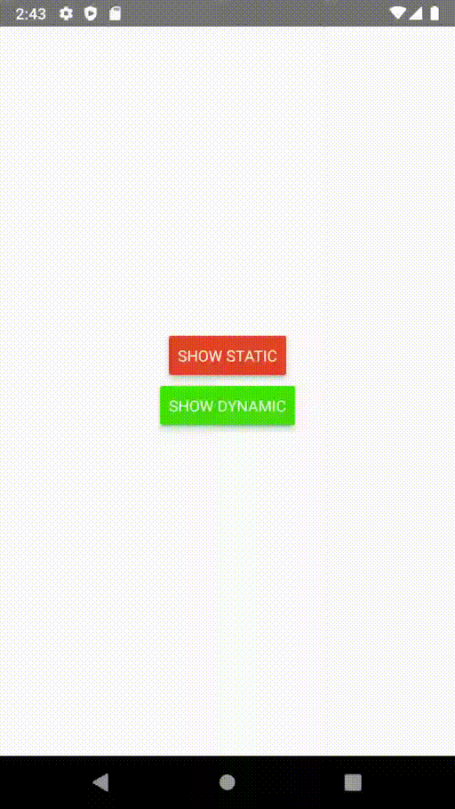

# ATTENTION
THIS PROJECT IS ARCHIVED! This is a really bad project I made as a junior, don't use it, it will be deleted soon. 


# react-native-nested-selects
This package allows you to easily create nested selects. 
Supported are static and dynamic selects. 
For own behaviour you can create your own components by subclassing and 
implementing only three required functions!

## Documentation
- [Preview](#preview)
- [Installation](#installation)
- [Usage](#usage)

### Preview


### Installation
Install the package using npm:
```shell
npm i --save react-native-nested-selects
```

### Usage
#### Example
This is the code for the app used in [preview](#preview).
```typescript jsx

import React, { useState } from "react";
import {
    Button,
    Text,
    View
} from "react-native";
import {
    DynamicSelect,
    StaticSelect
} from "react-native-nested-selects";

const App = () => {
    const [staticVisible, setStaticVisible] = useState(false),
        [dynamicVisible, setDynamicVisible] = useState(false),
        [text, setText] = useState("");
    let select;

    return (
        <View style={{
            flex: 1
        }}>
            <View style={{
                flex: 1,
                justifyContent: "center",
                alignItems: "center"
            }}>
                <View style={{ marginBottom: 10 }}>
                    <Button title="Show static" onPress={() => setStaticVisible(true)} color="#e34323" />
                </View>
                <View>
                    <Button title="Show dynamic" onPress={() => setDynamicVisible(true)} color="#43df08" />
                </View>
                <Text>{text}</Text>
            </View>
            <StaticSelect
                onAbort={() => setStaticVisible(false)}
                data={[
                    [
                        {
                            label: "A",
                            value: "a"
                        },
                        {
                            label: "B",
                            value: "b"
                        },
                        {
                            label: "C",
                            value: "c"
                        }
                    ],
                    [
                        {
                            label: "1",
                            value: 1
                        },
                        {
                            label: "2",
                            value: 2
                        }
                    ]
                ]}
                onDone={(args) => {
                    setStaticVisible(false);
                    setText(args);
                }}
                isVisible={staticVisible} />
            <DynamicSelect
                ref={item => select = item}
                onAbort={() => {
                    setDynamicVisible(false);
                    select.reset(); // If no reset call, the user will continue on the place where they aborted.
                }}
                data={[
                    {
                        label: "A",
                        value: "a",
                        nextLevel: [
                            {
                                label: "1",
                                value: 1
                            },
                            {
                                label: "2",
                                value: 2
                            }
                        ]
                    },
                    {
                        label: "B",
                        value: "b",
                        nextLevel: [
                            {
                                label: "3",
                                value: 3
                            },
                            {
                                label: "4",
                                value: 4
                            },
                            {
                                label: "Five",
                                value: 5,
                                nextLevel: [
                                    {
                                        label: "?",
                                        value: "?"
                                    },
                                    {
                                        label: "!",
                                        value: "!"
                                    }
                                ]
                            }
                        ]
                    },
                    {
                        label: "End now",
                        value: "d"
                    }
                ]}
                onDone={(args) => {
                    setDynamicVisible(false);
                    setText(args);
                }}
                isVisible={dynamicVisible} />
        </View>
    );
};
``` 

### Usage

#### StaticSelect
`StaticSelect` uses fixed selects. 
Each layer will be shown no matter what was chosen.

| Code | Description | Type |
|-|-|-|
| data | The data | Array<Array<DataObject>> |
| onAbort | Function executed when user aborts | Function |
| onDone | Function executed after the user is done selecting | Function |
| isVisible | Whether the select menu is visible | boolean |

#### DynamicSelect
`DynamicSelect` uses dynamic selects.
Each select object defines whether there is another layer or not.
To add another layer to a select, add one of the following values as a `nextLayer`-key.

##### Available `nextLevel` types
| Type | Description |
|-|-|
| `Array<DataObject/Object>` | Simple array of objects |
| `Function` | The function will be executed and must return an array of `DataObject`s. The first (and only) argument is the class instance |
| `undefined` (aka. no key) | The current layer will be used as the last layer and `onDone` will be called |

### Creating own selects
You can create your own subclass (aka. component) by extending `DefaultSelect` and implementing `AbstractBaseInterface`.
Your class will probably look like this:
```typescript jsx
class StaticSelect extends DefaultSelect<Props, States> implements AbstractBaseInterface{}
```
DefaultSelect contains three generic values:
```typescript jsx
abstract class DefaultSelect<P extends Props, S extends States, T = any>
```
| Value | Description |
|-|-|
| `P` | Props for the component |
| `S` | States for the component |
| `T` | The type of the given values (default: `any`) |

See JSDoc of `AbstractBaseInterface` to see how to continue.


